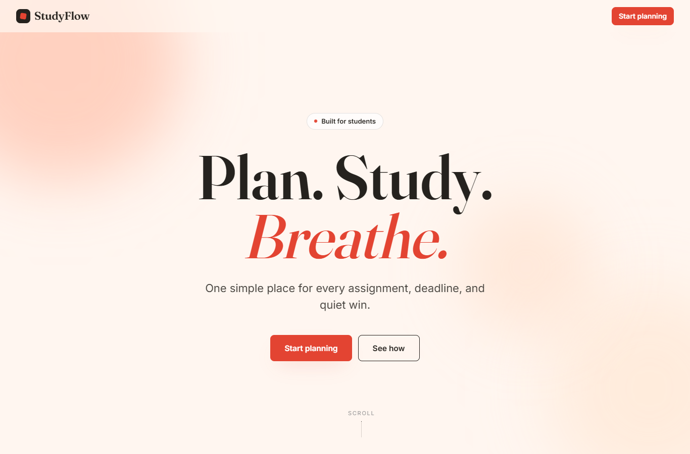

# StudyFlow

StudyFlow is a static study-planning website built with HTML, CSS, and JavaScript. It helps students organize subjects, tasks, deadlines, and weekly workload in one simple browser-based planner.

## Screenshot

Add the landing page screenshot here:

```md

```

## Project Overview

The project was created for a web programming course submission. The final website is a single-page app that uses hash navigation to switch between the main views without a backend server.

Main pages:

- Home / Landing page
- Today Dashboard
- Subjects page
- Weekly Calendar

## Features

- Add new study tasks.
- Mark tasks as complete or incomplete.
- Delete tasks.
- Add new subjects.
- Filter tasks by day, subject, upcoming work, overdue work, or all tasks.
- Move between calendar weeks.
- Save data in the browser with `localStorage`.
- Responsive layout for desktop and smaller screens.
- CSS animations on the landing page.

## Technology Used

- HTML for the page structure.
- CSS for the design system, layout, responsive rules, and animations.
- JavaScript for rendering pages, handling interactions, routing, and saving data.
- `localStorage` for browser-side data persistence.

## Final Runtime Files

- `index.html`
- `styles.css`
- `script.js`

## Documentation

Report and screenshot resources are stored in the `docs/` folder:

- `docs/report-assets.md`
- `docs/animation-notes.md`
- `docs/visual-review-notes.md`
- `docs/word-report-agent-prompt.md`

## How to Open

Open `index.html` directly in a browser.

```text
index.html
```

No installation or backend server is required.
