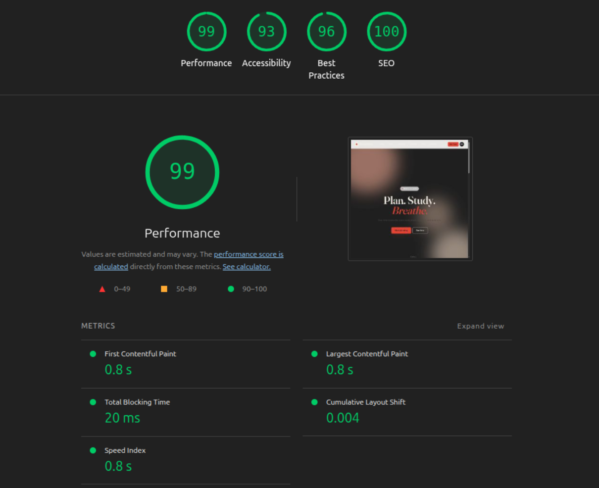

# StudyFlow

[](https://github.com/Inaolol/studyFlow/actions/workflows/ci.yml)
[](https://inaolol.github.io/studyFlow/)

A signal-reactive study planner — built with TypeScript, no framework.


**[Live demo →](https://inaolol.github.io/studyFlow/)**

---

## What & why

StudyFlow is a study planner for tracking tasks, deadlines, and Pomodoro sessions across subjects. It is a real, useful tool — not a toy — so the architectural decisions have genuine constraints behind them.

The goal was to demonstrate frontend architecture depth: routing, reactivity, persistence, rich charting — without reaching for a framework's scaffolding. If you understand what React or Vue are doing for you, you can build the same primitives from scratch with a much clearer mental model. StudyFlow is that exercise, documented and shipped.

It proves that a maintainable, type-safe, testable SPA can be built from first principles when you understand the abstractions underneath.

---

## Case study

### Problem framing

I wanted a portfolio piece that showed architectural judgment, not component assembly. The prompt: build a real study planner, ship it to GitHub Pages, make it installable as a PWA, get green Lighthouse scores, and write about every decision.

The constraint I imposed: no React, no Vue, no framework. Not as a purity exercise — to force explicit decisions about routing, state management, DOM updates, and persistence. Things a framework absorbs silently become visible and deliberate.

### Architectural decisions

**Hand-rolled 80-LOC signal library (`src/reactive/signal.ts`)**

The reactive core is `signal`, `computed`, and `effect` — a module-scoped dependency-tracking system with microtask-batched updates. ~8 unit tests cover tracking, batching, memoization, dispose, and leak prevention.

```ts
const count = signal(0);
const doubled = computed(() => count() * 2);
effect(() => console.log(doubled())); // logs 0, then 2, then 4
count.set(1); // → logs 2
count.set(2); // → logs 4
```

This is the portfolio talking point: understanding reactivity well enough to implement it cleanly in 80 lines.

**Store-as-signals, persistence-as-effect**

The store (`src/domain/store.ts`) is plain signals: `subjects`, `tasks`, `sessions`, `settings`, `active`. One `effect` serializes the store to localStorage debounced 200ms — it fires on any change, no manual subscription. The entire persistence layer is ~25 lines.

**Sessions as first-class records**

Pomodoro sessions are stored records (`Session[]`), not derived from timer runtime state. Stats compute from sessions + tasks, never from live state. This means stats survive task deletion, tab close mid-session, and time-zone changes. It also makes the stats domain pure and fully unit-testable with fabricated fixtures.

**Hash router, typed**

`src/ui/router.ts` is a ~60-line typed hash router. Each screen exports `mount(root): () => void`, returning a dispose function. The router calls dispose on navigation, preventing event-listener leaks. No library needed.

**CSS token split**

1709-line `styles.css` split into five files: `tokens.css` (design variables + dark-mode overrides), `base.css` (resets), `layout.css`, `components.css`, `animations.css`. Dark mode via `[data-theme="dark"]` overriding CSS custom properties. No FOUC: theme is resolved in a tiny inline script in `<head>` before CSS loads.

### Tradeoffs documented

**innerHTML re-render per effect region**

Each effect owns a DOM region and rebuilds `innerHTML` on change. No fine-grained DOM diffing. At StudyFlow's scale (a bounded list of study tasks), this is imperceptible — re-rendering 50 task rows takes <1ms. The tradeoff is documented here rather than hidden.

If the app grew to thousands of rows, keyed diffing would become necessary. For now, "make it work, then make it right" applies, and the decision is explicit.

**Minimal dependencies**

Runtime dependencies: `uplot` (45kB, canvas-based charts). That is it. No state library, no router library, no UI framework, no CSS framework. Each omission is a decision. The rule: only add a dependency if the alternative is genuinely worse, not just longer.

### What's next

- Fine-grained list patching for very large task lists
- Cloud sync + auth so data survives device changes
- Recurring tasks (most-requested missing feature)
- Native mobile via Capacitor once cloud sync is in place

---

## Features

| Feature | Description |
|---|---|
| Task management | Add, complete, delete tasks with subject, due date, and time estimate |
| Pomodoro timer | Task-bound 25/5/15 timer; sessions recorded as first-class data; drift-proof across tab close |
| Stats dashboard | Streak KPIs, 365-day heatmap, tasks/day bar, time-on-subject donut, weekly focus line, hour histogram, leaderboard |
| Keyboard shortcuts | `g t/s/c/d` navigate · `n` new task · `/` search · `j/k` move · `x` complete · `?` help |
| Dark mode | System/light/dark toggle; no FOUC; CSS custom-property tokens |
| Data portability | Export/import JSON backup; export iCal (.ics) for Apple/Google Calendar |
| PWA | Installable; offline-capable from second visit |
| Search | Case-insensitive substring search on Today screen, bound to `/` |

---

## Tech stack

| Tool | Role | Why |
|---|---|---|
| TypeScript 5 strict | Language | `noUncheckedIndexedAccess` + `exactOptionalPropertyTypes` catch real bugs at the type level |
| Vite 5 | Build | Fast HMR, ESM-native, trivial GitHub Pages deployment |
| vite-plugin-pwa | PWA | Zero-config Workbox; manifest + service worker without boilerplate |
| uPlot | Charts | 45kB, canvas-based, fast; no chart-framework overhead |
| Vitest | Unit tests | Same config as Vite; jsdom env for DOM-touching tests |
| Playwright | E2E | Real browser; `page.clock` for Pomodoro time manipulation |
| ESLint + typescript-eslint | Linting | Catches unused variables, unsafe calls, and style drift |
| Husky + lint-staged | Pre-commit | Typecheck + lint on staged files only |

---

## Local development

```bash
git clone https://github.com/Inaolol/studyFlow.git
cd studyFlow
npm install
npm run dev        # Vite dev server → http://localhost:5173/studyFlow/
npm test           # Vitest unit tests
npm run test:e2e   # Playwright E2E (requires: npm run build first)
npm run check      # typecheck + lint + unit tests (what CI runs)
```

---

## Lighthouse



Audited 2026-05-13 against the local production build. Scores: Performance 99 · Accessibility 93 · Best Practices 96 · SEO 100.

---

## Accessibility

- Skip link to main content (`#app`)
- All interactive elements have descriptive `aria-label` attributes
- Chart regions have `role="img"` with descriptive labels
- Keyboard navigation throughout: all actions reachable without a mouse
- Reduced-motion preference respected via `prefers-reduced-motion` and Settings override
- Colour contrast meets WCAG AA (accent `#e34432` on white)
- `tabindex="-1"` on `<main>` for skip-link focus target
