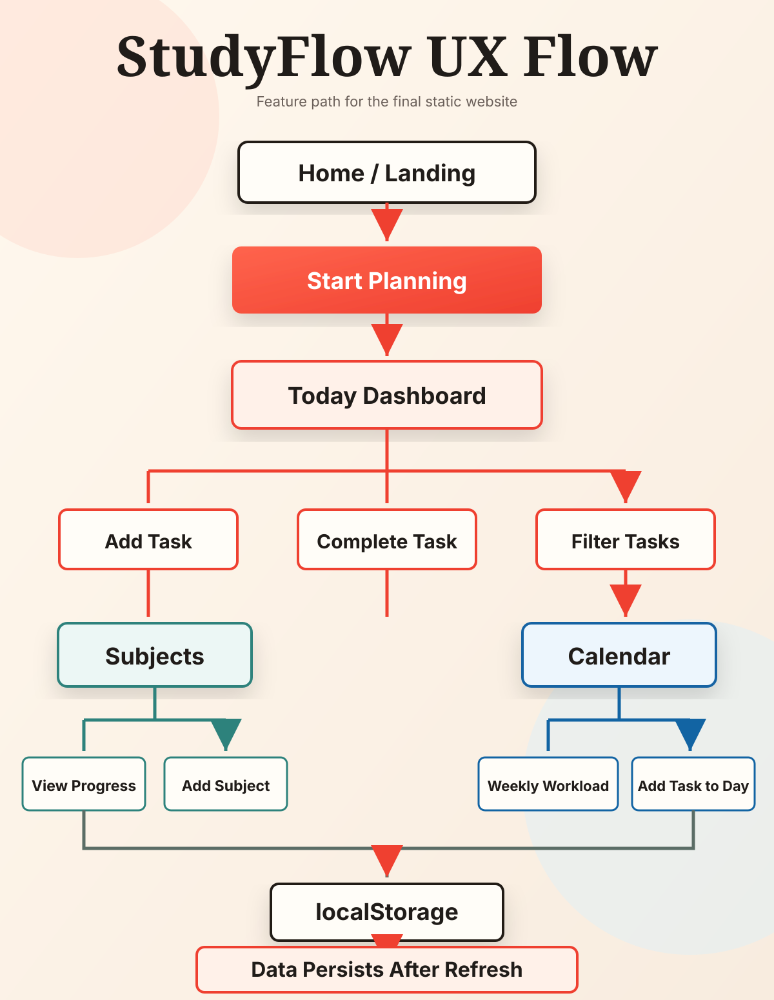

# StudyFlow

StudyFlow is a static study planner for students. It organizes subjects, tasks, deadlines, and weekly workload in one browser-based interface.


> The project is built with plain **HTML**, **CSS**, and **JavaScript** so the structure, styling, and behavior are easy to review.

## Project Summary

* **Purpose:** StudyFlow helps students see what to study today, what is coming next, and which subjects need attention.
* **Visual Layout:** The interface uses a calm cream background, charcoal text, coral actions, subject color tags, progress cards, task rows, and modal forms.
* **Document Structure:** The project is organized as one final static website with separate files for structure, style, and behavior.
* **Tone:** The design is simple and direct. It focuses on planning work instead of adding unnecessary screens.
* **Data Handling:** Tasks and subjects are saved in the browser using `localStorage`.
* **User Control:** The user decides what to add, complete, delete, or schedule. The website only organizes the information.

## Main Screens

| Screen | Purpose |
|---|---|
| Home | Introduces StudyFlow and explains the planner idea. |
| Today | Shows current tasks, progress, filters, and quick actions. |
| Subjects | Groups work by course and shows progress for each subject. |
| Calendar | Shows weekly workload and task distribution by day. |

## File Structure

```text
studyflow/
|-- index.html
|-- styles.css
|-- script.js
|-- README.md
|-- docs/
```

## Runtime Files

| File | Role |
|---|---|
| `index.html` | Semantic page shell with header, navigation, app mount, and modal mount. |
| `styles.css` | Design tokens, layout rules, cards, buttons, forms, responsive CSS, and animations. |
| `script.js` | Hash routing, rendering, events, task actions, subject actions, calendar navigation, and `localStorage`. |

## Feature Flow



## Key Features

* **Task Control:** Add, complete, uncomplete, and delete study tasks.
* **Subject Control:** Add subjects and assign tasks to them.
* **Dashboard Filters:** View today, next 7 days, overdue tasks, all tasks, or one subject.
* **Calendar Planning:** Move between weeks and add tasks for a selected day.
* **Pomodoro Timer:** Task-bound 25/5/15 timer docked at the viewport bottom; sessions are recorded as first-class records that survive reloads.
* **Stats Dashboard:** Streak KPIs, 365-day focus heatmap, tasks-per-day bar, time-on-subject donut, weekly focus line, hour-of-day histogram, and subject leaderboard.
* **Settings:** Theme (system/light/dark), reduced-motion preference, Pomodoro durations, and week-start day.
* **Keyboard Shortcuts:** `g t/s/c/d` to navigate, `n` for new task, `/` to search, `?` for the help overlay.
* **Search:** Case-insensitive substring search across task titles and notes on the Today screen.
* **Visual Feedback:** Progress cards, workload bars, subject colors, and completed task styling show status quickly.
* **Landing Animation:** CSS keyframes animate the landing headline, buttons, background blobs, and scroll cue.
